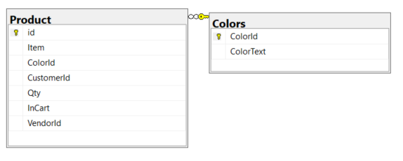

# Learn to use a databound DataGridView ComboBox in Windows Forms

## Preface

It’s the year 2023 and developers are still creating Windows Forms projects for many reasons from learning to code with no interest in web development or for write helper utilities.

No matter the developer expertise many struggle to implement a combo box in a DataGridView. The common approach is trial and error and usually involves unnecessarily accessing and changing combo box values through properties of a DataGridView.

> **Note**
> This is a .NET Core 7 project which was created from an old .NET Framework 4.8. This means Microsoft Visual Studio 2022 or later is needed.
s

## Implementation data bound with a database

For tables, yes tables as novice developers tend to use one table with a bad design.



- Product table is the main table to display in a DataGridView with ColorId references to Colors table to get the color text for, in this case the DataGridView combo box column
- Colors table contains available colors for te Product table.

Here is what we get for the finished product.


- The **BindingNavigator** is not avialable in Visual Studio toolbox so a custom BindingNavigator has been provided.
- **Current button** shows how to get information for the current row to Visual Studio's output window without touching the DataGridView rows and cells
- **Iterate rows button** shows how to get all rows to Visual Studio's output window without touching the DataGridView rows and cells
- Set none button shows how to set the current combo box to the first element.
- Set color button shows how to set the current row combo box value to a pre-define color.

## Setup database

- Open SSMS (SQL-Server Management Studio)
- Create the database and populate using under the script folder, script.sql which has instructions.
- As provided the database is set for SQLEXPRESS, change the connection string in ProductOperations.cs is not using SQLEXPRESS.


## How to setup a Combo box

:small_orange_diamond: First rule, forget about creating the DataGridView and setting up columns in code. Visual Studio provides a designer to create columns after dropping a DataGridView on a form.

:small_orange_diamond: Second rule, perform data operations in a class as done in ProductOperations class to separate form operations from data operations. In this case there is a read and update methods.

### Reading data

Start with reading data from the database done in ProductOperations class using the method LoadData which returns to DataTable containers which are deconstructed in the form.

- First read the Product table into a DataTable using the query in figure 1
- Next read in the Colors table into a DataTable using the query in figure 2
- The last section of code to add a Select option is optonal


**Figure 1**

```sql
SELECT id,Item,ColorId,CustomerId FROM Product
```

**Figure 2**
SELECT ColorId,ColorText FROM Colors ORDER BY ColorText
```sql

### Form code

- Setup columns in the DataGridView, in this case for Item column and ColorId column from the Product table 
- Create two private BindingSource components, one for each table.

**Setup method**

Indicate we have defined columns so do not auto generate columns in the DataGridView.

```csharp
ProductsDataGridView.AutoGenerateColumns = false;
```

Read data from ProductOperations

```csharp
var (productsTable, colorTable) = ProductOperations.LoadData();
```

Create a private scoped DataTable for use later on to get data not needed for column setup and populate from code above.

```csharp
_colorsDataTable = colorTable;
```

The following code sets up data for making the ComboBox work.

**Important**

Assign the color DataTable to the BindingSource _comboBoxBindingSource which becomes the DataSource for the ComboBox in the DataGridView

```csharp
_comboBoxBindingSource.DataSource = colorTable;
```

Assign the ComboBox column DisplayMember to the column from the DataTable for colors

```csharp
ColorComboBoxColumn.DisplayMember = "ColorText";
```

:stop_sign: This is where I see many developers rig up ValueMember and DataPropertyName wrong.

The next two lines are used to link the two tables together by the column ColorId


```csharp
ColorComboBoxColumn.ValueMember = "ColorId";
ColorComboBoxColumn.DataPropertyName = "ColorId";
```

Assign the color table to the BindingSource

```csharp
ColorComboBoxColumn.DataSource = _comboBoxBindingSource;
```

Set DisplayStyle to none do the ComboBox does not show until clicked.

```csharp
ColorComboBoxColumn.DisplayStyle = DataGridViewComboBoxDisplayStyle.Nothing;
```

Next assign product.Item to the DataGridView first column. You could set DataPropertyName in the designer if you desire,

```csharp
ItemTextBoxColumn.DataPropertyName = "Item";
_mainBindingSource.DataSource = productsTable;
```

Done, next let's move on to simple updating the current row.

## Update current row in the DataGridView

As the last line in Setup, subscribe to [RowChanged event](http://example.com) for the Product table.

```csharp
productsTable.RowChanged += ProductsTable_RowChanged;
```

**Implementation**

```csharp
private void ProductsTable_RowChanged(object sender, DataRowChangeEventArgs e)
{
        
    if (e.Action == DataRowAction.Change)
    {
        if (e.Row.Field<int>("ColorId") == -1)
        {
            // no color selected
            return;
        }
        var (success, exception) = ProductOperations.UpdateRow(e.Row);
        if (!success)
        {
            // should really write to a log file and not show the exception
            MessageBox.Show($"Failed to update\n{exception.Message}");
        }
    }
}
```

**Backend code**

- Recommend adding logging to the catch
- Note how parameters are setup, never use [AddWithValue](https://www.dbdelta.com/addwithvalue-is-evil/).

```csharp
public static (bool success, Exception exception) UpdateRow(DataRow row)
{
    using SqlConnection cn = new() { ConnectionString = _connectionString };
    using SqlCommand cmd = new() { Connection = cn };

    cmd.CommandText = 
        """
        UPDATE dbo.Product 
        SET Item = @Item,ColorId = @ColorId 
        WHERE id = @Id;
        """;

    cmd.Parameters.Add("@Item", SqlDbType.NVarChar).Value = 
        row.Field<string>("Item");
    cmd.Parameters.Add("@ColorId", SqlDbType.Int).Value = 
        row.Field<int>("ColorId");
    cmd.Parameters.Add("@Id", SqlDbType.Int).Value = 
        row.Field<int>("Id");

    try
    {
        cn.Open();
        var affected = cmd.ExecuteNonQuery();
        return (cmd.ExecuteNonQuery() == 1, null)!;
    }
    catch (Exception localException)
    {
        return (false,localException);
    }
}
```

## Add and delete data

Following what has been done with update. Also, check out the following for how to work with [DataTable events](https://github.com/karenpayneoregon/DataTablesOperationsEvents).


## Get current row information

To start, the following language extensions are used for obtaining information for the current row of the DataGridView.

```csharp
public static class BindingSourceExtensions
{
    /// <summary>
    /// Return DataSource as DataTable
    /// </summary>
    public static DataTable DataTable(this BindingSource sender)
        => (DataTable)sender.DataSource;


    /// <summary>
    /// Given Current is not null return a DataRow
    /// </summary>
    public static DataRow DataRow(this BindingSource sender)
        => ((DataRowView)sender.Current).Row;

}
```

From a button click

- Get the current row as a DataRow
- Query _comboBoxBindingSource DataTable to get the current color id
- Get the color name
- For this sample display the information in Visual Studio's output window.

```csharp
private void CurrentButton_Click(object sender, EventArgs e)
{
    if (_mainBindingSource.Current is null)
    {
        return;
    }

    DataRow currentRow = _mainBindingSource.DataRow();
        
    int colorIdentifier = _comboBoxBindingSource.DataTable().AsEnumerable()
        .FirstOrDefault(row => row.Field<int>("ColorId") == currentRow.Field<int>("ColorId"))
        .Field<int>("ColorId");

    string? colorName =_colorsDataTable.AsEnumerable().FirstOrDefault(row => 
        row.Field<int>("ColorId") == colorIdentifier).Field<string>("ColorText");

    Debug.WriteLine($"Current color Id: {colorIdentifier, -4} Name: {colorName}");

}
```

## Changing current row data

Kept simple using a known color primary key

```csharp
private void SetCurrentColorButton_Click(object sender, EventArgs e)
{
    DataRow currentRow = _mainBindingSource.DataRow();
    currentRow.SetField("ColorId", 4); // set to white
}
```

## Iterate all rows

Code is self describing.

```csharp
private void IterateRowsButton_Click(object sender, EventArgs e)
{
    DataTable productTable = _mainBindingSource.DataTable();
    DataTable colorTable = _comboBoxBindingSource.DataTable(); ;

    for (int rowIndex = 0; rowIndex < productTable.Rows.Count; rowIndex++)
    {
        var productName = productTable.Rows[rowIndex].Field<string>("Item");
        var colorIdentifier = productTable.Rows[rowIndex].Field<int>("ColorId");

        var colorName = colorTable
            .AsEnumerable()
            .FirstOrDefault(row => row.Field<int>("ColorId") == colorIdentifier)
            .Field<string>("ColorText");


        Debug.WriteLine($"{rowIndex,-5}{productName,-15}{colorName}");
    }
}
```

## Important notes

Other than setting up the DataGridView there is zero need to touch the DataGridView to gain access to data as per all code presented. Many developers starting out tend to not think about (because they are new to coding) the approach presented here. The author’s mindset when working with desktop projects, in this case Windows forms is to avoid touching controls to access data. Next level is to move away from a DataTable in favor of classes. When working with classes [INotifyPropertyChanged](https://learn.microsoft.com/en-us/dotnet/desktop/wpf/data/how-to-implement-property-change-notification?view=netframeworkdesktop-4.8) needs to be implemented for data binding meaning this interface provides change notification which is native to DataTable. 

Besides implementing INotifyPropertyChanged consider adding a BindingList to the mix which means no casting of data but when using a BindingList sorting for the DataGridView is no available but when replaced with SortableBindingList found in source code sorting works.

## Next steps

Once the source code has been cloned and the database setup, run the project and try changing data. Then go back and study the code carefully, at first dependent on your expertise it may take time.

> **Note**
> While running the project and making changes have SSMS open to see the changes or write a SELECT statement in a .sql file in Visual Studio to monitor changes.

SELECT statement

```sql
SELECT P.id,
       P.Item,
       P.ColorId,
       C.ColorText,
       P.CustomerId,
       P.Qty,
       P.InCart,
       P.VendorId
FROM dbo.Product AS P
    INNER JOIN dbo.Colors AS C
        ON P.ColorId = C.ColorId;
```

Once the code has meaning it will be easy to adapt to any Windows Form project.

## Bonus

The author never uses MessageBox to display information, instead uses [TaskDialogPage](http://example.com). I included a basic example in Dialogs.cs and for more samples see the following [GitHub repository](https://github.com/karenpayneoregon/task-dialog-csharp) and [article](https://dev.to/karenpayneoregon/net-core-taskdialog-2o4l).

## Source code

Clone the following GitHub repository, open in Microsoft Visual Studio 2022 or higher with .NET Core 7 Framework installed.
