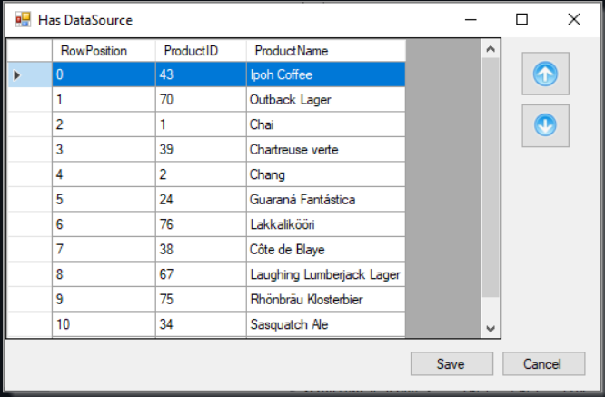

# About

Provides a basic code sample for working with a DataGridView ComboBox were the only time the DataGridView is touched is for setting the DataGridView up, otherwise all access to data is using two BindingSource components.

Since the BindingNavigator is not in Visual Studio toolbox one is included.

Screenshot of finished form.

- Uses Microsoft Visual Studio 2022, will work on later versions
- .NET Core 7
- SQL-Server database
- Uses BindingSource and DataTable, sure we could uses classes which is mentioned in the project's readme file and high level how to do this including how to implement sorting with a BindingList.

## Motivation

It is 2023 and no matter that developers are using ASP.NET Core, Razor Pages, WPF and MAUI there are still developers asking how to use a ComboBox in a DataGridView in forums like Stackoverflow.

## Instructions

- See readme.md in the code sample project
- Follow the instructions to setup the database
- Run the project
- Inspect the code, learn...
- Adapt to a project

## Related

[GitHub repository](https://github.com/karenpayneoregon/WindowsFormsMoveItemsUpDown): Windows Forms move items up/down which has projects in .NET Framework and .NET Core 7 Framework.

## Article

[Learn to use a databound DataGridView ComboBox in Windows Forms](https://dev.to/karenpayneoregon/learn-to-use-a-databound-datagridview-combobox-in-windows-forms-1coa)